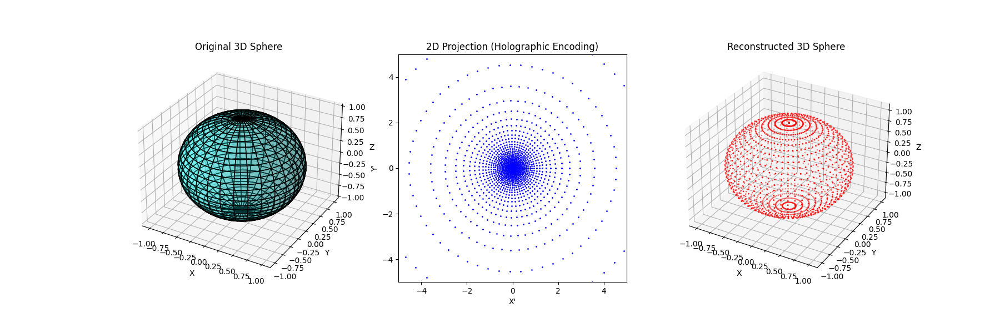

# How Stereographic Projection Reveals an Emergent Dimension

## Historical Context

Although its precise origin is unclear, stereographic projection can be traced back to Ancient Greek astronomy.

## Stereographic Projection as an Analogy

The stereographic projection offers a fascinating analogy for understanding emergent dimensions — the idea that higher-dimensional information can be encoded in a lower-dimensional surface. While not a physical model, it helps visualize the idea that the third dimension of spacetime might be emergent — not fundamental — arising from a deeper 2D description.

## Stereographic Projection: A Gateway to Dimensional Mapping

This mathematical technique maps points from a 3D sphere onto a
2D plane, demonstrating how three-dimensional data can be represented in fewer dimensions. Crucially, the projection is reversible — meaning the original 3D structure can be perfectly reconstructed from its 2D counterpart.

### Projecting 3D onto 2D

For a unit sphere **S²** centered at the origin in 3D space with coordinates (x, y, z), the **stereographic projection** onto the xy-plane is given by:

$$
x' = \frac{x}{1 - z}, \quad y' = \frac{y}{1 - z}
$$

where (x', y') are the coordinates of the projected point on the 2D plane.

### Reconstructing 3D from 2D

To recover the 3D coordinates from the 2D projection, we use the **inverse stereographic projection**:

$$
x = \frac{2x'}{1 + x'^2 + y'^2}, \quad y = \frac{2y'}{1 + x'^2 + y'^2}, \quad z = \frac{1 - x'^2 - y'^2}{1 + x'^2 + y'^2}
$$

This reversibility illustrates how higher-dimensional information can be encoded and decoded in a lower-dimensional framework — an essential concept in theories of emergent spacetime.

## From Math to Physics: The Emergent Dimension Analogy

The stereographic projection serves as a classical geometric analogy for the holographic principle, which suggests that our 3D universe might be encoded on a 2D boundary. However, this is just an illustration — the real holographic principle in quantum gravity involves far deeper mechanisms, such as:

- Quantum entanglement
- Boundary conformal field theories
- Non-local information encoding
  
Still, the stereographic projection provides valuable intuition for how extra dimensions could emerge from simpler structures.

### Why This Matters

By studying such projections, we gain insight into how:

- Higher-dimensional physics might arise from lower-dimensional rules.
- Spacetime itself could be an emergent phenomenon.
- Quantum gravity theories (like AdS/CFT*) use holographic encoding.
  *Anti-de Sitter/Conformal Field Theory

While the full picture requires advanced quantum theory, the stereographic projection offers a beautiful geometric gateway into these profound ideas.
