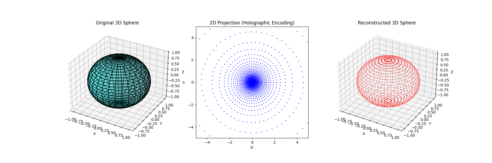

# How Stereographic Projection Can Demonstrate an Emergent Dimension?

The **stereographic projection** provides a classical analogy for the concept of **emergent dimensions**, showing how higher-dimensional information can be encoded onto a lower-dimensional surface. This can be used to explore the idea that the **third dimension** of spacetime might not be fundamental, but rather an **emergent property** arising from a more fundamental 2D description.

## Stereographic Projection Overview

The stereographic projection maps points from a **3D sphere** onto a **2D plane**, offering a way to encode 3D information onto a 2D surface. This projection is reversible, meaning we can reconstruct the 3D sphere from the 2D projection.

### 1. Stereographic Projection Formula

Given a unit sphere \( S^2 \) centered at the origin in 3D space with coordinates \( (x, y, z) \), the **stereographic projection** onto a plane (typically the \( xy \)-plane) is given by the following formulas:

$$
\large
x' = \frac{x}{1 - z}, \quad y' = \frac{y}{1 - z}
\large

$$

where \( (x', y') \) are the coordinates of the point on the 2D plane.

### 2. Inverse Stereographic Projection

To recover the 3D coordinates from the 2D projection, we use the **inverse stereographic projection**:

$$
\large
x = \frac{2x'}{1 + x'^2 + y'^2}, \quad y = \frac{2y'}{1 + x'^2 + y'^2}, \quad z = \frac{1 - x'^2 - y'^2}{1 + x'^2 + y'^2}
\large
$$

These formulas allow us to reconstruct the 3D sphere from its 2D projection, illustrating the idea that the **third dimension** might emerge from **lower-dimensional data**.

## Demonstrating Emergence

In the context of the **holographic principle**, the stereographic projection serves as a metaphor for how a 3D system could be encoded in a lower-dimensional surface, much like how **spacetime** (including the third dimension) might emerge from a more fundamental 2D description. This supports the idea that dimensions are **not necessarily fundamental** but could arise as **emergent properties** from quantum field theories on a boundary.

However, it's important to note that the **real holographic principle** in **quantum mechanics** is a bit more complicated. It involves **quantum entanglement** and **boundary field theories** in ways that go beyond the simple classical analogy provided by stereographic projection.

---

By examining the **stereographic projection** in this way, we see how **information from higher dimensions** (such as 3D) can be encoded in **lower-dimensional surfaces** (like 2D), offering a visual representation of how **emergent dimensions** might work in a quantum gravity framework.
